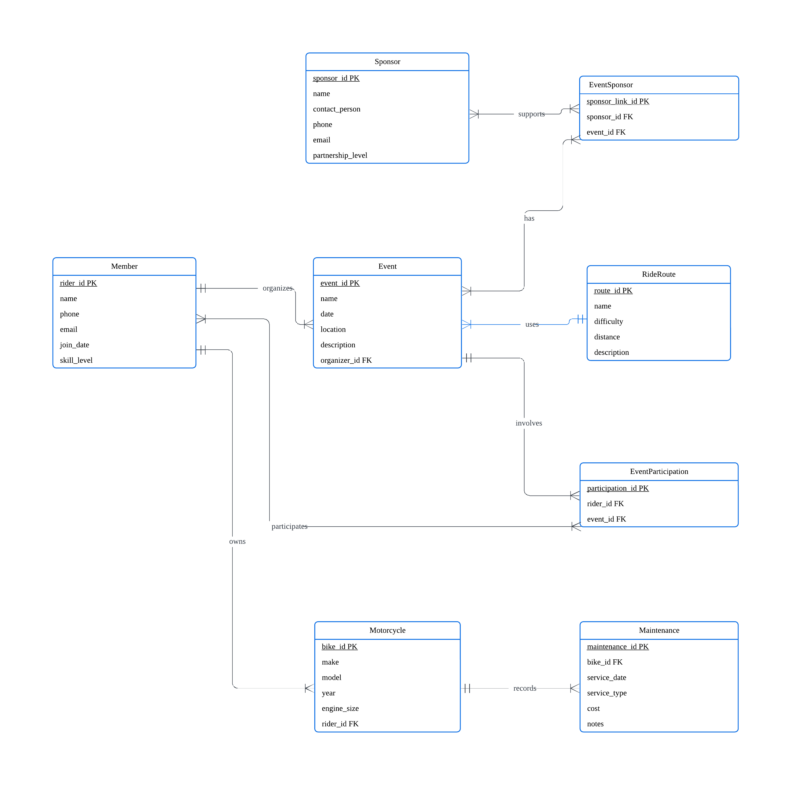
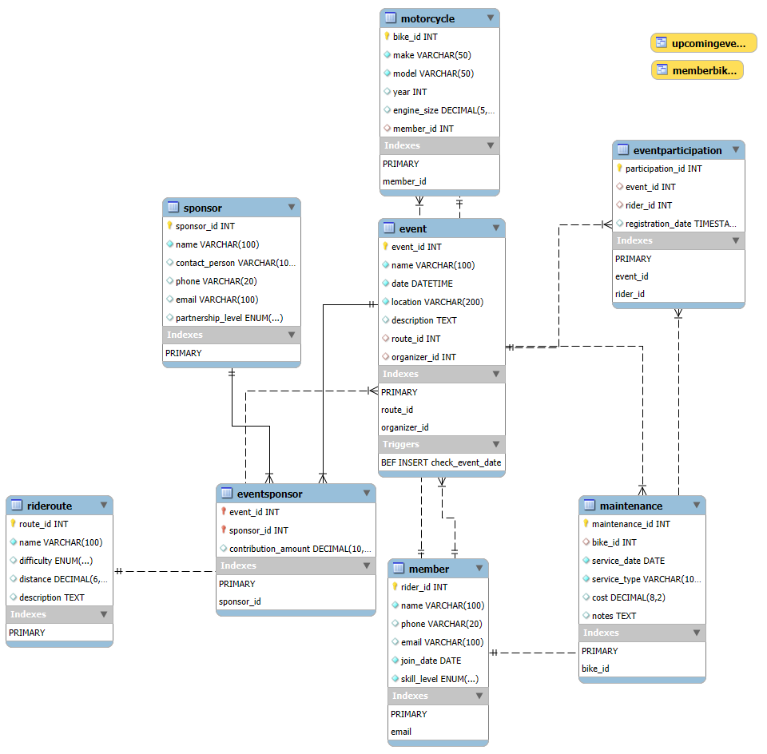

**DATE CREATED**: Apr 24 2025      

**PARTICIPANTS**: 
David MJ Choi 
Bankey Cheong 
Stephen Lam

## License
This project is licensed under the [MIT License](https://mit-license.org).

## **[TO-DOs]**
* **[COMPLETED: STEPHEN, May 1]** ER diagram
* EER diagram
* **[BASICALLY COMPLETED: David, May 3]** DDL statements
* **[ONGOING: David, May 3]** Sample data
    * Suggestion: generate more using Gen-AI.
* **[ONGOING: David, May 3]** Queries implementation
* Sort and typeset the final report
    * Strong points (optional in the report)

# Database Design Project for Local Motorcycle Community

## 1 Domain Description

Our database will serve a **local motorcycle community**, tracking **members**, their **bikes**, **events**, **rides**, **maintenance records**, and **sponsors**.

This application will help 
* organize community activities
* maintain rider/bike information
* facilitate event planning 
  

The database will **store** details about 
* members (contact info, skill levels)
* their motorcycles (make, model, year)
* maintenance history
* community events (rides, meetups)
* event participation
* sponsors who support the community

This system will enable **queries** about 
* upcoming events
* rider statistics
* bike specifications
* maintenance schedules 

The motorcycle community database needs to handle relationships between riders and their multiple bikes, track event attendance, and manage sponsor partnerships while ensuring data integrity through appropriate constraints.

## 2 Database Requirements
### Entities
1. **Member**: rider_id (PK), name, phone, email, join_date, skill_level
2. **Motorcycle**: bike_id (PK), make, model, year, engine_size, member_id (FK)
3. **Event**: event_id (PK), name, date, location, description, organizer_id (FK)
4. **Maintenance**: maintenance_id (PK), bike_id (FK), service_date, service_type, cost, notes
5. **Sponsor**: sponsor_id (PK), name, contact_person, phone, email, partnership_level
6. **RideRoute**: route_id (PK), name, difficulty, distance, description
7. **EventSponsor**: event_id (FK), sponsor_id (FK) - junction table

**NOTE:** (PK) -> Primary Key; (FK) -> Foreign Key

### Relationships
- Member owns Motorcycle (one-to-many)
- Member organizes Event (one-to-many)
- Member participates in Event (many-to-many via separate participation table)
- Motorcycle has Maintenance records (one-to-many)
- Event uses RideRoute (many-to-one)
- Event has Sponsors (many-to-many via EventSponsor)
- Sponsor supports multiple Events (many-to-many)

### Constraints
- Member email must be unique
- Motorcycle year must be later than 1900
- Event date must be in the future when created
- Maintenance cost must be positive
- Skill level must be 'beginner', 'intermediate', or 'expert'

## 3 ER Diagram

**Relationships**

- Member **owns** Motorcycle (1 to many)
- Member **organizes** Event (1 to many)
- Member **participates in** Event (many to many via EventParticipation)
- Motorcycle **has** Maintenance records (1 to many)
- Event **uses** RideRoute (many to one)
- Event **has** Sponsors (many to many via EventSponsor)
- Sponsor **supports** multiple Events (many to many via EventSponsor)

## 4 EER model

-- --

*You can view and edit this ER diagram directly at the [lucid](https://lucid.app/lucidchart/6688c01e-cea6-4ec4-8315-8dac2a079742/edit?viewport_loc=-648%2C849%2C3332%2C1374%2C0_0&invitationId=inv_cd8cc2fc-ff14-42d8-a774-647c008aabea).*
