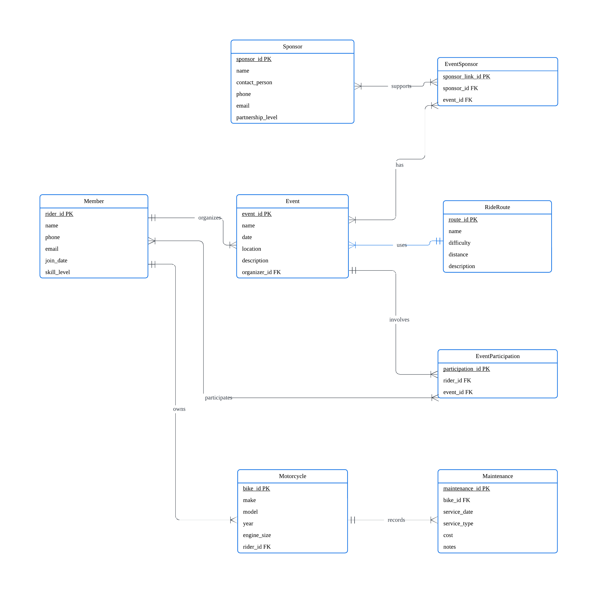
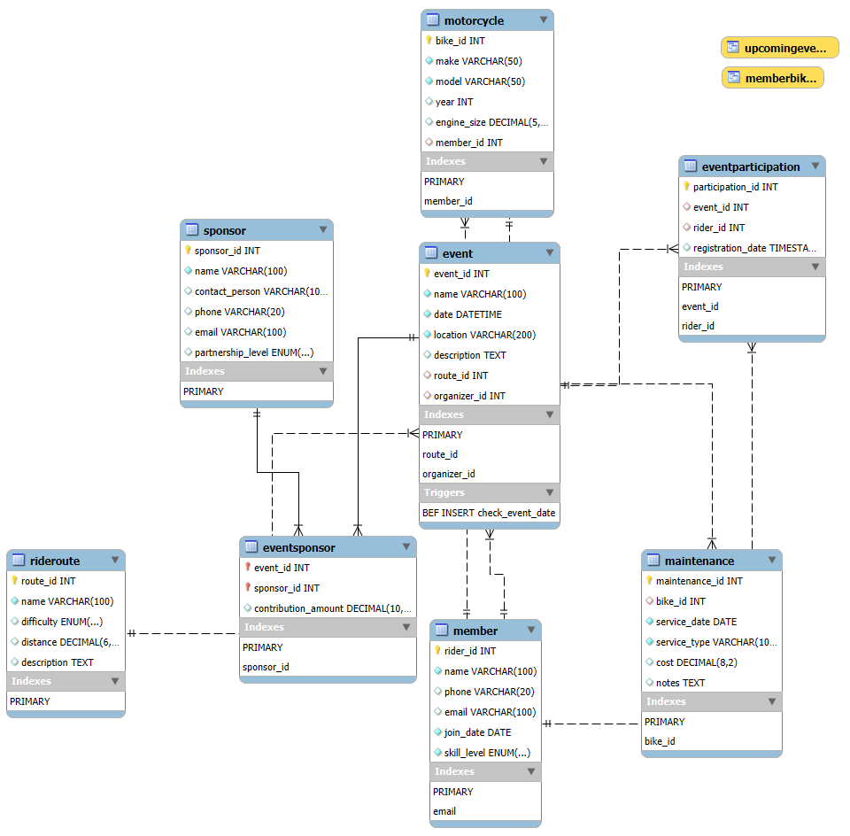

# Local Motorcycle Community
___
## A Domain Description
Our database will serve a **local motorcycle community**, tracking **members**, their **bikes**, **events**, **rides**, **maintenance records**, and **sponsors**.

This application will help
* organize community activities
* maintain rider/bike information
* facilitate event planning

The database will **store** details about
* members (contact info, skill levels)
* their motorcycles (make, model, year)
* maintenance history
* community events (rides, meetups)
* event participation
* sponsors who support the community

This system will enable **queries** about
* upcoming events
* rider statistics
* bike specifications
* maintenance schedules

The motorcycle community database needs to handle relationships between riders and their multiple bikes, track event attendance, and manage sponsor partnerships while ensuring data integrity through appropriate constraints.
___
## B Descriptions of entities, relationships, attributes, keys, constraints
### **Entities​**​
1. ​**​Member​**​  
    Represents motorcycle club members.
    
    - _Attributes_:
        - `rider_id` (Primary Key): Unique identifier for each member
        - `name`: Member's full name
        - `phone`: Contact number
        - `email`: Unique email address
        - `join_date`: Date when member joined the club
        - `skill_level`: Competency level ('beginner', 'intermediate', or 'expert')
2. ​**​Motorcycle​**​  
    Stores motorcycles owned by members.
    
    - _Attributes_:
        - `bike_id` (Primary Key): Unique identifier for each motorcycle
        - `make`: Manufacturer brand (e.g., Harley-Davidson)
        - `model`: Bike model name
        - `year`: Manufacturing year (must be > 1900)
        - `engine_size`: Engine capacity in cc
        - `member_id` (Foreign Key): References the owning member
3. ​**​Event​**​  
    Tracks club-organized riding events.
    
    - _Attributes_:
        - `event_id` (Primary Key): Unique event identifier
        - `name`: Event title (e.g., "Annual Mountain Ride")
        - `date`: Scheduled date (must be future-dated at creation)
        - `location`: Venue or starting point
        - `description`: Event details
        - `organizer_id` (Foreign Key): References the member who organized it
4. ​**​Maintenance​**​  
    Records motorcycle service history.
    
    - _Attributes_:
        - `maintenance_id` (Primary Key): Unique service record ID
        - `bike_id` (Foreign Key): References the serviced motorcycle
        - `service_date`: Date of maintenance
        - `service_type`: Description of service (e.g., oil change)
        - `cost`: Service charge (must be positive)
        - `notes`: Additional comments
5. ​**​Sponsor​**​  
    Contains sponsor organizations supporting events.
    
    - _Attributes_:
        - `sponsor_id` (Primary Key): Unique sponsor identifier
        - `name`: Sponsor company name
        - `contact_person`: Representative's name
        - `phone`: Contact number
        - `email`: Email address
        - `partnership_level`: Tier of sponsorship (e.g., gold/silver/bronze)
6. ​**​RideRoute​**​  
    Defines predefined riding paths for events.
    
    - _Attributes_:
        - `route_id` (Primary Key): Unique route identifier
        - `name`: Route title (e.g., "Coastal Highway Loop")
        - `difficulty`: Challenge level (e.g., easy/moderate/hard)
        - `distance`: Total length in miles/kilometers
        - `description`: Route landmarks or features
7. ​**​EventSponsor​**​ (Junction Table)  
    Manages many-to-many relationships between events and sponsors.
    
    - _Attributes_:
        - `event_id` (Foreign Key): References an event
        - `sponsor_id` (Foreign Key): References a supporting sponsor

### ​**​Relationships​**​

- ​**​Ownership​**​:  
    One ​**​Member​**​ can own multiple ​**​Motorcycles​**​ (one-to-many).
    
- ​**​Event Organization​**​:  
    One ​**​Member​**​ can organize multiple ​**​Events​**​ (one-to-many).
    
- ​**​Event Participation​**​:  
    Many ​**​Members​**​ can participate in many ​**​Events​**​ (many-to-many).
    
- ​**​Maintenance History​**​:  
    Each ​**​Motorcycle​**​ can have multiple ​**​Maintenance​**​ records (one-to-many).
    
- ​**​Route Assignment​**​:  
    Multiple ​**​Events​**​ may use the same ​**​RideRoute​**​ (many-to-one).
    
- ​**​Sponsorship​**​:  
    An ​**​Event​**​ can have multiple ​**​Sponsors​**​, and a ​**​Sponsor​**​ can support multiple ​**​Events​**​ (many-to-many via ​**​EventSponsor​**​).
    
### ​**​Constraints​**​

1. ​**​Uniqueness​**​:
    
    - Member emails must be unique (`email` in ​**​Member​**​).
2. ​**​Value Validity​**​:
    
    - Motorcycle `year` must be > 1900.
    - Event `date` must be in the future when the record is created.
    - Maintenance `cost` must be a positive number.
    - Member `skill_level` must be one of: 'beginner', 'intermediate', or 'expert'.
3. ​**​Referential Integrity​**​:
    
    - All foreign keys (e.g., `member_id` in ​**​Motorcycle​**​) must reference valid primary keys in related tables.
___
## C ER Diagram

___
## D EER model
  




  
___
## E DDL of those tables, views, functions, and procedures.
### **Tables**
```sql
CREATE TABLE Member (
    rider_id INT AUTO_INCREMENT PRIMARY KEY,
    name VARCHAR(100) NOT NULL,
    phone VARCHAR(20),
    email VARCHAR(100) UNIQUE,
    join_date DATE NOT NULL,
    skill_level ENUM('beginner', 'intermediate', 'expert') NOT NULL
);

CREATE TABLE Motorcycle (
    bike_id INT AUTO_INCREMENT PRIMARY KEY,
    make VARCHAR(50) NOT NULL,
    model VARCHAR(50) NOT NULL,
    year INT CHECK (year > 1900),
    engine_size DECIMAL(5,2),
    member_id INT,
    FOREIGN KEY (member_id) REFERENCES Member(rider_id)
);

CREATE TABLE RideRoute (
    route_id INT AUTO_INCREMENT PRIMARY KEY,
    name VARCHAR(100) NOT NULL,
    difficulty ENUM('easy', 'medium', 'hard', 'expert'),
    distance DECIMAL(6,2),
    description TEXT
);

CREATE TABLE Event (
    event_id INT AUTO_INCREMENT PRIMARY KEY,
    name VARCHAR(100) NOT NULL,
    date DATETIME NOT NULL,
    location VARCHAR(200) NOT NULL,
    description TEXT,
    route_id INT,
    organizer_id INT,
    FOREIGN KEY (route_id) REFERENCES RideRoute(route_id),
    FOREIGN KEY (organizer_id) REFERENCES Member(rider_id)
    -- CHECK (date > NOW())
);

CREATE TABLE EventParticipation (
    participation_id INT AUTO_INCREMENT PRIMARY KEY,
    event_id INT,
    rider_id INT,
    registration_date TIMESTAMP DEFAULT CURRENT_TIMESTAMP,
    FOREIGN KEY (event_id) REFERENCES Event(event_id),
    FOREIGN KEY (rider_id) REFERENCES Member(rider_id),
    UNIQUE (event_id, rider_id)
);

CREATE TABLE Maintenance (
    maintenance_id INT AUTO_INCREMENT PRIMARY KEY,
    bike_id INT,
    service_date DATE NOT NULL,
    service_type VARCHAR(100) NOT NULL,
    cost DECIMAL(8,2) CHECK (cost > 0),
    notes TEXT,
    FOREIGN KEY (bike_id) REFERENCES Motorcycle(bike_id)
);

CREATE TABLE Sponsor (
    sponsor_id INT AUTO_INCREMENT PRIMARY KEY,
    name VARCHAR(100) NOT NULL,
    contact_person VARCHAR(100),
    phone VARCHAR(20),
    email VARCHAR(100),
    partnership_level ENUM('bronze', 'silver', 'gold', 'platinum')
);

CREATE TABLE EventSponsor (
    event_id INT,
    sponsor_id INT,
    contribution_amount DECIMAL(10,2),
    PRIMARY KEY (event_id, sponsor_id),
    FOREIGN KEY (event_id) REFERENCES Event(event_id),
    FOREIGN KEY (sponsor_id) REFERENCES Sponsor(sponsor_id)
);


DELIMITER //
CREATE TRIGGER check_event_date
BEFORE INSERT ON Event
FOR EACH ROW
BEGIN
    IF NEW.date <= NOW() THEN
        SIGNAL SQLSTATE '45000'
        SET MESSAGE_TEXT = 'Event date must be in the future';
    END IF;
END //
DELIMITER ;
```
### **Views**
```sql
CREATE VIEW UpcomingEvents AS
SELECT e.name, e.date, e.location, r.name AS route, m.name AS organizer
FROM Event e
JOIN RideRoute r ON e.route_id = r.route_id
JOIN Member m ON e.organizer_id = m.rider_id
WHERE e.date > NOW()
ORDER BY e.date;

CREATE VIEW MemberBikes AS
SELECT m.name AS member, mc.make, mc.model, mc.year, mc.engine_size
FROM Member m
JOIN Motorcycle mc ON m.rider_id = mc.member_id
ORDER BY m.name, mc.year DESC;
```
### **Functions**
```sql
-- Functions
DELIMITER //
CREATE FUNCTION CalculateRideDuration(ride_distance DECIMAL(6,2), avg_speed DECIMAL(5,2))
RETURNS DECIMAL(5,2)
DETERMINISTIC
BEGIN
    DECLARE duration DECIMAL(5,2);
    SET duration = ride_distance / avg_speed;
    RETURN duration;
END //
DELIMITER ;
```
### **Procedures**
```sql
DELIMITER //
CREATE PROCEDURE GetMembersBySkillLevel(IN skill VARCHAR(20))
BEGIN
    SELECT name, email, phone, join_date
    FROM Member
    WHERE skill_level = skill
    ORDER BY join_date;
END //
DELIMITER ;

DELIMITER //
CREATE PROCEDURE ScheduleMaintenance(
    IN bike_id INT,
    IN service_type VARCHAR(100),
    IN estimated_cost DECIMAL(8,2),
    IN notes TEXT
)
BEGIN
    INSERT INTO Maintenance (bike_id, service_date, service_type, cost, notes)
    VALUES (bike_id, CURDATE(), service_type, estimated_cost, notes);
END //
DELIMITER ;
```
___
## F For each table, print its results
![[./assets/Pasted image 20250505151741.png]]
![[./assets/Pasted image 20250505151757.png]]
![[./assets/Pasted image 20250505151810.png]]
![[./assets/Pasted image 20250505151819.png]]
![[./assets/Pasted image 20250505151828.png]]
![[./assets/Pasted image 20250505151842.png]]
![[./assets/Pasted image 20250505151850.png]]
![[./assets/Pasted image 20250505151937.png]]
___
## G Query and its result


